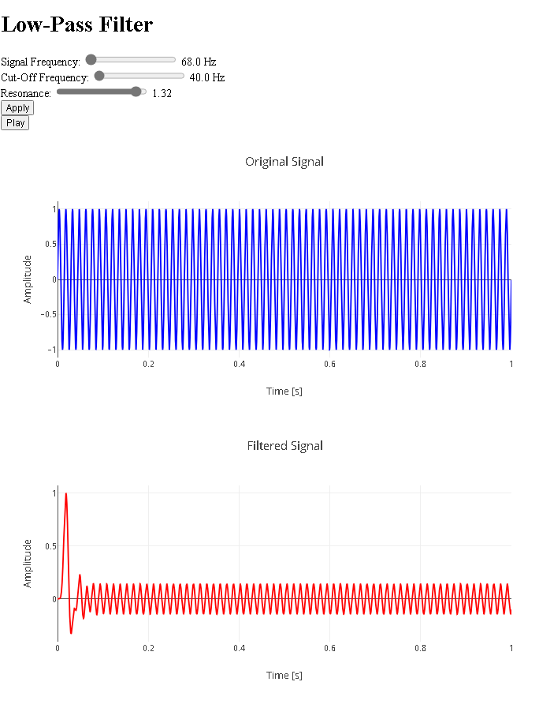

# Low-Pass Filter Application

## General Description

This web application allows users to apply a low-pass filter to a synthetically generated audio signal. Users can adjust the signal frequency, the filter cutoff frequency, and the resonance through a web interface. The original and filtered signals are visualized using Plotly, and the user can also play the filtered signal.

## Application Functionality

### User Interface:

- Users can adjust the signal and filter parameters using sliders in the form.
- The parameters include the signal frequency, the filter cutoff frequency, and the resonance.

### Signal Visualization:

- After setting the parameters, users can view the graphs of the original and filtered signals.
- The graphs are generated using Plotly and show the signal's behavior over time.

### Signal Playback:

- Users can play the filtered signal by clicking a button.
- Playback is handled using the Web Audio API.

## How to Download and Run the Application

To get started with the **Low-Pass Filter Application**, follow these simple steps:

1. **Clone the Repository:**
   ```bash
   git clone https://github.com/Mike014/Low-Pass-Filter-Application.git
   cd Low-Pass-Filter-Application

1. **Run the Development Server:**
   ```bash
   python manage.py runserver

1. **Access the Application:**
   ```bash
   Open your web browser and navigate to http://127.0.0.1:8000/ to start using the application.

## Conclusion

This application demonstrates how to use Django to create an interactive web interface that allows users to apply a low-pass filter to an audio signal. It uses Plotly to visualize the signals and the Web Audio API to play the filtered signal.


